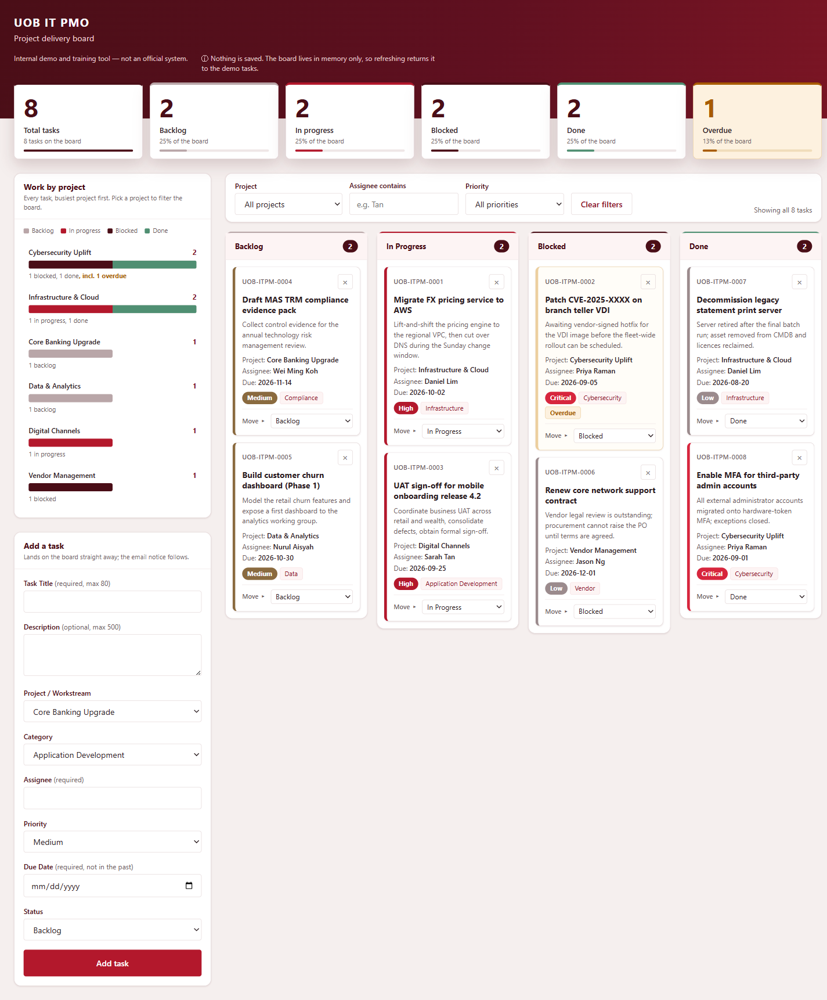

# UOB IT PMO — Project Delivery Board

A single-file, dependency-free Kanban board for tracking IT project delivery work.
Built as an internal **demo / training tool** for a PMO — it is not an official system
and it stores nothing.

**Live demo:** https://alfredang.github.io/kanban3/

## Running it locally

Download `index.html` and **double-click it**. That's the whole setup — no build step,
no server, no `npm install`. It runs straight from `file://` in any modern browser.

## Features

- **KPI rail** — six large cards across the top (total, each of the four statuses, and
  overdue), each with a share-of-board bar. Overdue is styled in ochre rather than red so
  it stays readable against the red interface.
- **Work-by-project chart** — a stacked horizontal bar per project, busiest first, split by
  status. Bar length scales against the busiest project, so rows compare by volume as well
  as by mix. Each row is a button that filters the board to that project.
- **Four-column board** — Backlog, In Progress, Blocked, Done — with drag-and-drop
  between columns, plus a per-card "Move" dropdown as a keyboard/touch-friendly fallback.
- **Add Task form** with inline validation (no `alert()` popups): required title (max 80)
  and assignee, optional description (max 500), due date, and dropdowns for project,
  category, priority and starting status.
- **Auto-generated task IDs** in the form `UOB-ITPM-0001`, continuing past the seeded tasks.
- **Filtering** by project, assignee and priority. Column count badges reflect the
  *filtered* view, while the KPI rail and the project chart always count *all* tasks —
  deliberately, so the portfolio headline doesn't move while you filter.
- **Overdue highlighting** — any task past its due date that isn't Done is flagged on the
  card, in the project chart and in the KPI rail. Dates are compared as `YYYY-MM-DD`
  strings in local time.
- **Inline delete confirmation** — a Yes/No row inside the card, not a native `confirm()`.
- **Toast notifications** for adds, moves, deletes and errors.
- **Optional email notification** on new tasks via [FormSubmit](https://formsubmit.co).
- **Responsive** — the board drops to two columns below 1200px and stacks below 768px,
  where the KPI rail goes two-up. Reduced-motion preferences are respected.
- **XSS-safe rendering** — every user-supplied string is escaped before it reaches the DOM.
- Seeded with eight realistic IT PMO tasks across six workstreams so the board is
  useful the moment it opens.

## Caveats worth knowing

- **Nothing is persisted.** There is no `localStorage`, no database, no backend.
  Refreshing the page resets the board to the seed data — this is intentional and is
  announced in the header.
- **Email notifications need configuring.** `FORMSUBMIT_ENDPOINT` ships as the
  placeholder `YOUR_EMAIL@example.com`. Until you replace it with a real address *and*
  click FormSubmit's one-time activation link, every submit shows an
  "email notification failed" warning toast. That's expected, not a bug — the card is
  still added either way; the network call is deliberately isolated from the board state.
- **Drag-and-drop** relies on the HTML5 drag API, so on touch devices use the card's
  Move dropdown instead.

## Tech

Vanilla HTML, CSS and JavaScript in one file. No framework, no bundler, no external
resources — system font stack and inline SVG/Unicode glyphs only. The single outbound
URL in the file is the FormSubmit endpoint.

## Note on branding

Internal demo only. The "UOB IT PMO" wordmark here is plain text; the project uses no
UOB logo or trademark and is not intended to imitate an official UOB system.
